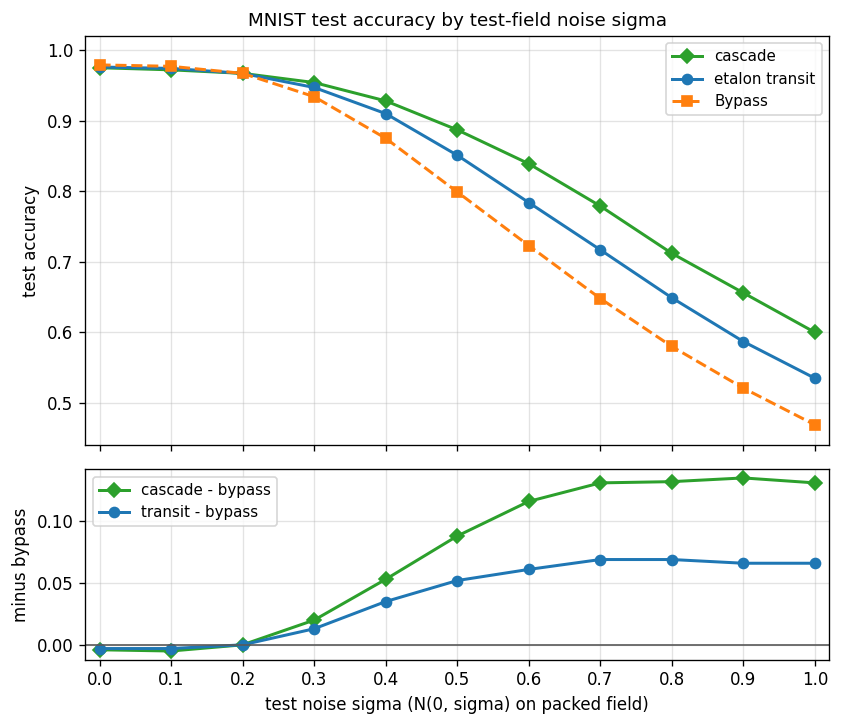

# Hypercube Cascade

[](https://github.com/dliptak001/HypercubeCascade/actions/workflows/wheels.yml)
[](https://pypi.org/project/hypercube-cascade/)
[](https://pypi.org/project/hypercube-cascade/)
[](LICENSE)
[](https://en.cppreference.com/w/cpp/23)

HypercubeCascade processes spatial data of the kind presented to a CNN.
It is built from four core classes.

The **Cascade** class wraps the other three and manages training and
prediction.

The other three form a pipeline: etalon → reservoir → readout.

The **Exciter** class is a preprocessing stage that consumes input
patterns, mixes them nonlinearly, and returns a field with the same
dimensions as the input.

The **Reservoir** class is a second preprocessing stage that consumes
that field, drives a short synthetic orbit on a frozen hypercube
reservoir, and returns a field with the same dimensions.

The **Readout** class is a small HypercubeCNN that classifies or
regresses that field.

This is reservoir computing, but not only reservoir computing.

The point of this experiment is to see if two preprocessing stages in
front of HypercubeCNN outperform HypercubeCNN by itself, and
outperform either stage alone. HypercubeEtalon is the etalon alone.
HypercubeWTF is the reservoir alone. Cascade runs them in series.
The aim is a hypercube preprocessor effective enough that the readout
can be a single layer with a single convolutional channel and no
pooling. Then training is fast, the memory footprint is small, and
little to no architectural engineering is required for the CNN.

---

<p align="center">
  <strong>HypercubeAI ecosystem</strong><br/>
</p>

<p align="center">
  <a href="https://github.com/dliptak001/HypercubeCascade"><strong>HypercubeCascade</strong></a>
  &nbsp;·&nbsp;
  <a href="https://github.com/dliptak001/HypercubeCNN"><strong>HypercubeCNN</strong></a>
  &nbsp;·&nbsp;
  <a href="https://github.com/dliptak001/HypercubeESN"><strong>HypercubeESN</strong></a>
  &nbsp;·&nbsp;
  <a href="https://github.com/dliptak001/HypercubeEtalon"><strong>HypercubeEtalon</strong></a>
  &nbsp;·&nbsp;
  <a href="https://github.com/dliptak001/HypercubeHopfield"><strong>HypercubeHopfield</strong></a>
  &nbsp;·&nbsp;
  <a href="https://github.com/dliptak001/HypercubeLCN"><strong>HypercubeLCN</strong></a>
  &nbsp;·&nbsp;
  <a href="https://github.com/dliptak001/HypercubeWorldModel"><strong>HypercubeWorldModel</strong></a>
  &nbsp;·&nbsp;
  <a href="https://github.com/dliptak001/HypercubeWTF"><strong>HypercubeWTF</strong></a>
</p>

<p align="center">
  📄 Foundational paper:
  <a href="docs/Boolean_hypercubes_as_a_neural_substrate.pdf"><em>Boolean Hypercubes as a Neural Substrate</em></a>
  (D.&nbsp;C.&nbsp;Liptak, 2026)
</p>

HypercubeCascade is an experiment in the **HypercubeAI** project — our quest to
systematically re-implement classical neural architectures on a Boolean
hypercube topology instead of Euclidean grids or random graphs. The central
thesis is “topology-native intelligence”: the hypercube’s algebraic structure
(vertex-transitive symmetry, Hamming geometry, bitwise addressing) can serve
as a first-class computational substrate.

- **A topology you don’t store** — the graph is specified: connectivity is
  implicit in the vertex indices; with a seed and a few config scalars the whole
  reservoir reconstructs mathematically.
- **Perfect homogeneity** — every vertex has the same degree and the same local
  world, so local dynamics mean the same thing everywhere — no structural
  favorites baked in by a random graph.
- **Cheap navigation** — each neighbor is a few bit operations on the vertex
  index, not a pointer chase through a stored edge list, so walks stay
  arithmetic and cache-friendly.
- **Topology-native pairing** — the readout consumes the reservoir’s output with
  zero geometric distortion, and the learned kernels exploit the same locality
  that generated the dynamics. The data never leaves the hypercube it was born
  on.

Each product in the family is a different architecture on that same foundation.

---

## The Cascade

HypercubeEtalon and HypercubeWTF are two examples of how
solutions can be built on that substrate. Cascade is both of them, in
series, on one cube.

There is one cube dimension. The Exciter, the Reservoir, and the
Readout all use it.

An etalon, here, is a vertex and its antipode treated as a reflective
cavity. The Exciter walks every such cavity and writes one output
sample per start. That walk is the etalon transit. The write-up is
[HypercubeEtalon](https://github.com/dliptak001/HypercubeEtalon).

The Reservoir is the HypercubeWTF encoder: frozen recurrent weights,
a delay line, and a short synthetic orbit. Geometry stays put; the
registration of the field moves. The write-up is
[HypercubeWTF](https://github.com/dliptak001/HypercubeWTF).

The cascade itself goes something like this.

    Copy the input field. Never write the caller's buffer.

    Run one etalon transit. The cube is the same size it started as.

    Multiply that field by the interstage gain.

    Reload the reservoir's frozen start.

    LOOP:

        Remap the scaled field by xor with the pass index.

        Inject that remapping. Step the reservoir.

    GOTO LOOP

    After T passes, the reservoir's live output is the feature field.
    That is what the Readout sees.

The single-stage write-ups live with the siblings. This repository is
the two-stage host.

---

## White noise filter

The Cascade preprocessor behaves as a near unity passthrough at low
to no white noise levels, and offers meaningful filtering effect
at moderate to high noise levels. The write-up is
[`examples/mnist/WhiteNoiseFilter.md`](examples/mnist/WhiteNoiseFilter.md).



---

## Raman baseline extraction (a vibrational spectroscopy application)

The first real-world test is Raman spectra: recover the slow
fluorescence background under sharp molecular peaks without
lifting the baseline into the bands or cutting trenches beneath
them. Polynomials, asymmetric least squares, and ordinary
convolutional nets tend to follow the empty stretches well and then
fail where it matters, under peaks and peak clusters. Analysts have
worked around that for decades with spectrum-specific cleanup,
because no method identifies and extracts a true baseline across a
broad range of peak intensities and baseline characteristics
without occasional, and often frequent, human intervention.

The Cascade appears to have solved that problem (albeit on synthetic
data only so far).

Trained for 60 epochs on the LCOHard set — 10,000 synthetic LiCoO₂
(lithium cobalt oxide) spectra — it scores a validation RMSE of
4.82 counts on 2,000 held-out spectra whose baselines span
hundreds of counts.

Below are four held-out validation spectra: grey is the raw
spectrum, red the true baseline, blue the extract. For all four
shown here, and for each of the remaining 1996 validation spectra
not shown, baseline identification is, **WITHOUT EXCEPTION**,
quite remarkable.

And it does this with the thin readout the project aims for: one
HypercubeCNN layer, one convolutional channel, no pooling.

In our judgment this at least matches the best of the established
techniques on spectra like these, and very likely beats them.


### Three hosts, one floor

The etalon-only sibling
([HypercubeEtalon](https://github.com/dliptak001/HypercubeEtalon))
is this Cascade with the reservoir removed. The reservoir-only
sibling ([HypercubeWTF](https://github.com/dliptak001/HypercubeWTF))
is this Cascade with the transit removed: the same frozen reservoir
— same seed, spectral radius, history depth, and pass count — driven
by the normalized spectrum directly. Each of them, on its own,
already does everything described above. With the very same readout
configuration and the same 60-epoch budget, the Etalon scores 4.77
and WTF 4.76 against the Cascade's 4.82, and all three overlays are
indistinguishable from the one shown. Three preprocessors that share
no mechanism — a transit, an orbit, and the two in series — carry
the same one-layer, one-channel readout to the same floor.

Real spectra, however, are not nearly this clean. Low laser power,
short integration times, and weak scatterers all put noise on the
spectrum, and that is where a baseline extractor has to earn its
keep.

That is what the Cascade's second stage, the Reservoir, is for. On
the strength of the MNIST white-noise study
([`examples/mnist/WhiteNoiseFilter.md`](examples/mnist/WhiteNoiseFilter.md)),
the Cascade is expected to outperform the Etalon alone in that
noise — and WTF's own study
([`examples/mnist/WhiteNoiseFilter.md`](https://github.com/dliptak001/HypercubeWTF/blob/main/examples/mnist/WhiteNoiseFilter.md))
found that same reservoir a filter that holds accuracy as the noise
rises. Whether the transit in front of it adds anything under noise,
or whether the reservoir is doing all of the filtering, is the open
question.

That is the next experiment.

Side-by-side overlays and all three training profiles are in
[`examples/RamanBaselineExtraction/`](examples/RamanBaselineExtraction/README.md).

---

## SDKs

**C++** — link `HypercubeCascadeCore`, include `Cascade.h`, work with
`Cascade`. The guide is [`docs/CPP_SDK.md`](docs/CPP_SDK.md).

**Python** — `pip install hypercube-cascade`, import `hypercube_cascade`,
work with `Cascade`. The guide is
[`docs/Python_SDK.md`](docs/Python_SDK.md); the PyPI-facing package readme is
[`python/README.md`](python/README.md). Bindings build from this repo via
`pip install ./python` (pybind11 + scikit-build; does not use the CLion
`cmake-build-*` trees).

```python
import numpy as np
import hypercube_cascade as hc

cas = hc.Cascade(dim=7, exciter_subcube_dim=5, T=50, interstage_scale=5.5,
                 history_depth=4, readout_num_outputs=6,
                 readout_task="classification", readout_epochs=100)
cas.fit(fields_train, labels_train)          # (count, N) float32, (count,) int
test_acc = cas.accuracy(fields_test, labels_test)
```

The concept write-up is
[`docs/CascadeWhitePaper.md`](docs/CascadeWhitePaper.md).

---
