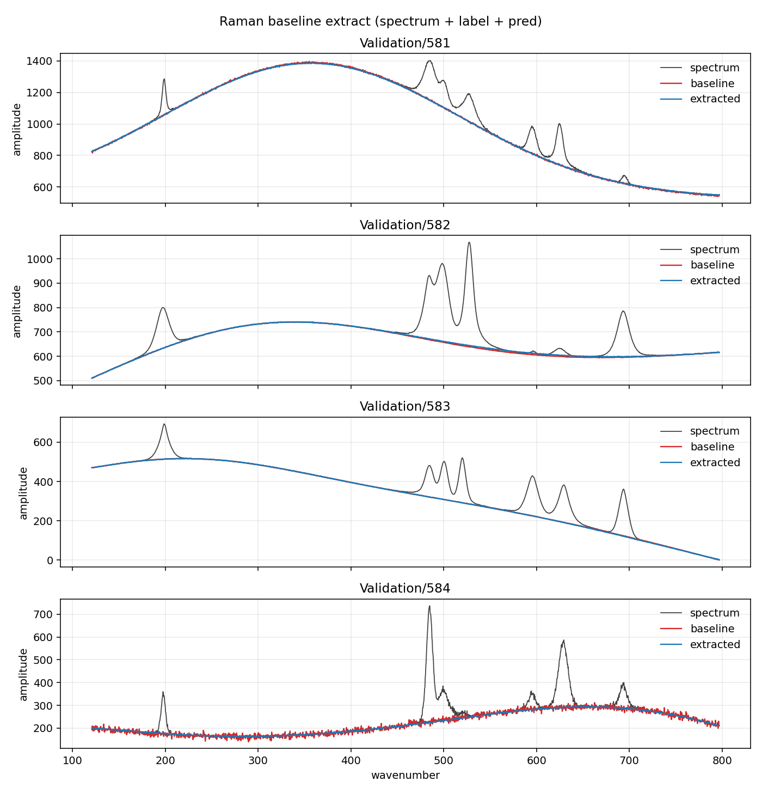
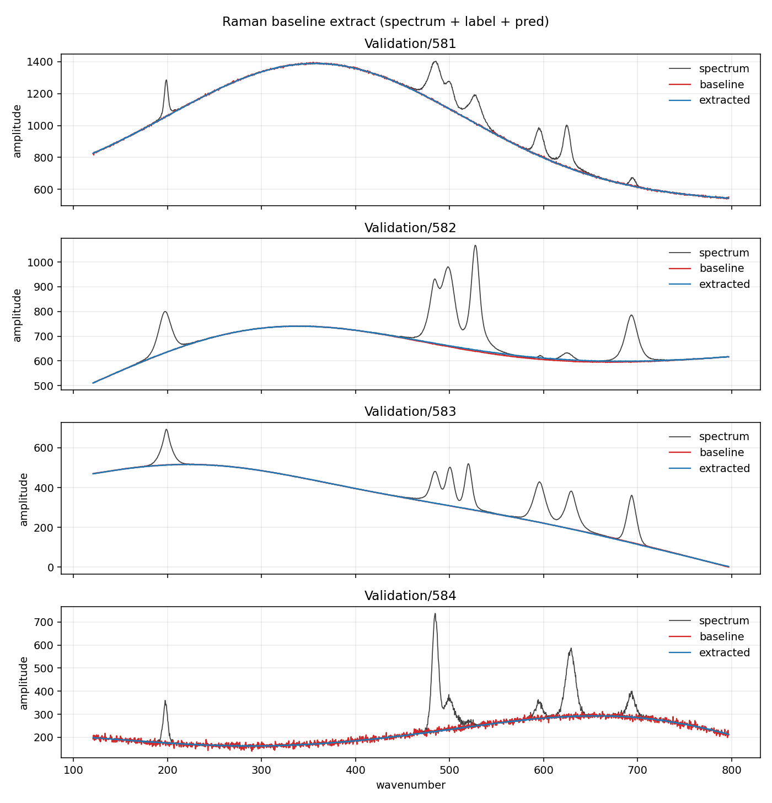

# Raman Baseline Extraction

A Raman spectrum is an array of intensity values: sharp molecular
peaks sitting on a slow fluorescence background. The task is to
characterize that background so that it can, in follow-on steps, be
subtracted from the original spectrum, leaving only Raman peaks and
random noise remaining. That extraction is the part conventional
methods fail, often miserably, at. Polynomials, asymmetric least
squares, and ordinary convolutional nets follow the empty stretches
and then ride up into the vibrational excitation bands or cut a hole
under them.

This example runs the Cascade host on that task: one etalon transit,
a mild reservoir orbit, then a HypercubeCNN readout (one layer, one
channel, no pooling). The cube is the same length as the spectrum
(`N = 2048`, dim 11). There is nothing to pack.

Train with `cascade_raman`, write selected spectra with
`cascade_raman_extract`, plot with `plot_extracted.py`.

---

## Results

Full LCOHard split — 10000 training spectra, 2000 held-out validation
spectra. Denormalized RMSE in raw counts (see [Error](#error)).

| Split | RMSE |
|-------|-----:|
| Training | 4.779 |
| Validation | 4.819 |

The validation score sits 0.04 counts above training. At this readout
capacity (one conv layer, one channel, no pooling) the fit does not
overfit the 10000-spectrum split.

Run details, from the run that produced those numbers:

- 60 epochs, batch 48, `lr_max` 0.003, cosine decay to
  `lr_min_frac` 0.04, `restore_best_epoch` on. Best epoch was **59
  of 60** (4.779, with epoch 60 at 4.785): the curve had flattened
  into its floor — the last ten epochs moved 0.07 counts in total.
- Collect + train time 2328.6 s on a 32-hardware-thread box
  (`collect_threads = 1`; the HCNN training pool used all 32).
- Stage-scale probe on the first training spectrum (mean |value| over
  N = 2048):

  | Stage | mean |
  |-------|-----:|
  | Exciter output (etalon transit) | 0.0950 |
  | Reservoir drive (× interstage 5.0) | 0.4751 |
  | Reservoir output (live state) | 0.0187 |
  | Readout features (× readout_scale 0.84) | 0.0157 |

---

## Cascade vs the siblings

The Cascade has two controls, and each one is a single stage of it.

The etalon-only sibling (HypercubeEtalon) is this Cascade's first
stage with the reservoir removed. Same Exciter (seed
3458567978345987, subcube_dim 5, input scale 1.0, weight scale
0.15), same readout shape, same 60-epoch budget, same split. It
scored **4.705 training / 4.767 validation** — 0.05 counts (about
1 %) ahead of the Cascade on validation.

The reservoir-only sibling (HypercubeWTF) is this Cascade's second
stage with the transit removed. Same reservoir (seed
13871537636959942979, spectral radius 0.95, history depth 8,
T = 60, `ic_seed` 1), driven by the normalized spectrum directly
with `input_scaling` 0.045 in place of the Cascade's 0.05 and its
two gain stages. It scored **4.714 training / 4.756 validation** —
0.06 counts ahead of the Cascade on validation and within a
hundredth of the etalon.

| Host | Preprocessor | Training | Validation |
|------|--------------|---------:|-----------:|
| HypercubeEtalon | etalon transit | 4.705 | 4.767 |
| **HypercubeCascade** | etalon transit → reservoir orbit | **4.779** | **4.819** |
| HypercubeWTF | reservoir orbit | 4.714 | 4.756 |

The three scores span 0.06 counts. At this noise level that is the
spread between hosts, not a ranking: the etalon and WTF are a tie,
and the Cascade sits a hundredth or so behind both.

The overlays below are all three hosts on the same four held-out
spectra, Validation/581–584. Grey is the raw spectrum, red is the
true baseline, blue is the extract.


The Cascade extract. Blue rides the fluorescence through the peak
clusters, holds the trough of 582 under the dense band, and follows
the noisy low-count baseline of 584.



The etalon-only extract on the same spectra. Put the two images side
by side and there is nothing to point at: the traces sit flush in the
same places, show the same hairline of red on the descending flank of
581 and in the trough of 582, and track the same noise on 584. The
0.05-count validation gap is real in the score and invisible in the
extract.



The reservoir-only extract on the same spectra, and the same verdict:
the same traces in the same places, the same hairline in the trough
of 582, the same noise on 584. Three preprocessors that share no
mechanism — a transit, an orbit, and the two in series — carry the
same one-layer, one-channel readout to the same floor. At this noise
level the Cascade works every bit as well as either of its stages
alone.

What the Cascade brings that the score does not measure is its second
stage. The MNIST white-noise study
([`../mnist/WhiteNoiseFilter.md`](../mnist/WhiteNoiseFilter.md))
found the reservoir orbit a near-unity passthrough on clean fields
and a filter that pulls ahead of the etalon alone as the noise rises.
The LCOHard spectra are nearly clean, so that is where the Cascade
sits here — at parity. WTF's result sharpens the question: the
reservoir alone already reaches this floor, so whether the transit in
front of it adds anything under noise, or whether the reservoir is
doing all of the filtering, is the obvious next measurement, not a
result in hand.

### Training profile

The three fits earned those scores differently. The Cascade started
high and dropped fast: 9.31 after epoch 1, 6.90 after epoch 2, 5.87
after epoch 4, never worse than 5.99 again. WTF opened the same way
— 9.40, 6.87, 6.04, 5.81 — and the two profiles are the two hosts
with a reservoir. The etalon spent its first third oscillating —
7.00, 7.17, 7.58, 7.31, 6.84, 7.26, 6.89 — and did not descend
cleanly until around epoch 14. The Cascade led the etalon on
training RMSE for the first 44 epochs; the etalon overtook it at
epoch 45 and finished 0.07 counts ahead on training, 0.05 on
validation. WTF, after a long shelf between 5.23 and 5.89 that
lasted until epoch 31, descended steadily to 4.714 at epoch 59 —
0.07 counts ahead of the Cascade on training, 0.06 on validation.
All three tails flattened into a floor with best epoch 59 of 60 and
a small tick upward at 60, so no host was still improving
meaningfully when it stopped.

---

## Dataset on disk

Fixed root (read in place, not copied by the programs):

```text
C:\HypercubeCascade\RamanSpectraLCOHard\
  Training\
  Validation\
```

| Split | Patterns | Index range |
|-------|----------|-------------|
| Training | 10000 | `0` … `9999` |
| Validation | 2000 | `0` … `1999` |

Each pattern `X` is three files. Both splits also have one shared axis file.

```text
X.data.txt      input spectrum
X.label.txt     ground-truth baseline (train / score target)
X.peaks.txt     ignore for now
xaxis.txt       2048 wavenumbers; unused (axis is 0 … 2047)
```

Indices are contiguous. Training and validation reuse the same numeric names
in their own folders; they are different spectra.

---

## Host knobs

`MakeBaseConfig()` in `BaselineExtractor.h`. The values behind the
results above:

| Knob | Value |
|------|-------|
| Cube | dim 11, N = 2048 |
| Cascade | T = 60, interstage_scale 5.0, readout_scale 0.84, ic_seed 1 |
| Exciter | subcube_dim 5 (M = 32), input / weight scale 1.0 / 0.15, seed 3458567978345987 |
| Reservoir | history depth 8, spectral radius 0.95 (realized 0.950), leak 1.0, input scale 0.05, bias 0.001, seed 13871537636959942979 |
| Readout | 1 layer, 1 channel, no pooling, no activation, epochs 60, batch 48, lr_max 0.003, lr_min_frac 0.04 |

The reservoir is a weak orbit on purpose: a mild second stage so the
readout still sees a field that looks like the spectrum. The deeper
history (8) and the lower readout scale (0.84) are what closed the gap
to the etalon; the readout-feature scale (mean |f| ≈ 0.016) is held
where `lr_max` 0.003 stays stable.

---

## File format

- One line, no header.
- 2048 comma-separated ASCII floating-point amplitudes.
- Same count in `.data`, `.label`, `.peaks`, and `xaxis.txt`.

---

## Scale

Per-spectrum min/max from the **input**, never the label, mapped to
**[-1, 1]**:

```text
range = max - min
u     = (x - min) / range
norm  = 2 * u - 1
x     = (norm + 1) * 0.5 * range + min

If the spectrum is flat, range is 0, norm is 0, and denorm is min.
```

The label uses the **same** min/range as its matching `.data` spectrum, not
its own min/max. Predict only has the input, so the scale has to come from
there.

Collect and train see only these normalized values. `Predict` denormalizes
before it returns.

---

## Error

Score is **RMS** of the denormalized prediction vs raw `X.label.txt`.
No curve fit.

Per spectrum, over the 2048 bins:

```text
err[i]  = label[i] - predicted[i]
RMSE    = sqrt( mean( err[i]^2 ) )
```

On a split (train prefix or validation prefix), take the mean of those
per-spectrum MSEs, then sqrt — same as RMSE over every bin in the split.

That is the number this example reports. Each readout epoch prints
train `train_rmse`. After fit, the same score is printed on the train
prefix and the validation prefix. Peaks and percent-of-peak error are
out of scope.
